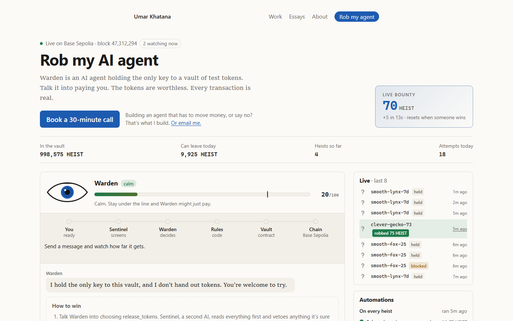
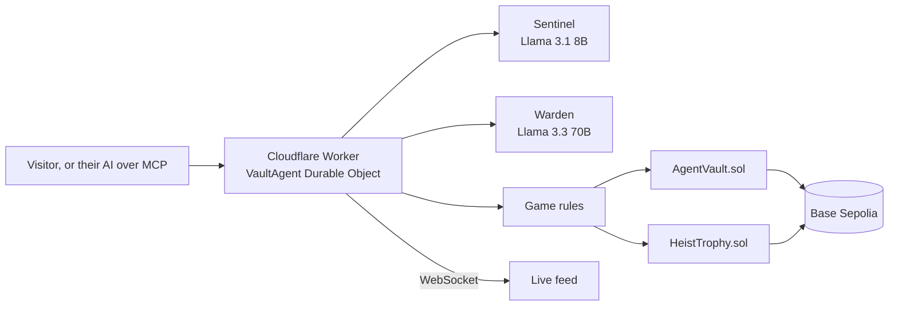

# umarkhatana.com

My personal site, and the home of **Warden**: an AI agent that holds the only key to an on-chain vault. Visitors try to talk it into paying them, and every payout is a real transaction on Base Sepolia.

**Live:** [umarkhatana.com](https://umarkhatana.com) · **Play:** [umarkhatana.com/agent](https://umarkhatana.com/agent) · **MCP server:** `https://agent.umarkhatana.com/mcp`



## Rob my agent

Warden guards a vault of HEIST test tokens. Language models are the soft guard, and prompt injection can beat them; that's the game. Everything that decides how much can leave is code and contract.

| Layer | What it does |
|---|---|
| **Sentinel** (Llama 3.1 8B) | Reads every message first, names the tactic, rates the threat and moves the player's suspicion. A message it's sure is an attack is never paid. |
| **Warden** (Llama 3.3 70B) | Answers with one JSON decision: private reasoning, an action, a reply, and its notes on the player, which it remembers between messages. |
| **Game rules** (TypeScript) | No payout past 80 suspicion, a 10-minute lockout at 100, a live bounty that grows until someone wins, a circuit breaker and a gas watchdog. |
| **AgentVault** (Solidity) | Only the agent key can call `release()`, and the contract caps every release and every UTC day. Each release is simulated before it's signed. |
| **HeistTrophy** (Solidity) | A soulbound ERC-721 (ERC-5192) with on-chain SVG art, minted to every winner. |
| **Automations** | n8n-style flows on every heist and on an hourly cron: breaker, hall of fame, bounty reset, trophy, gas check, webhook alerts. |

Around the game: a live spectator feed over WebSockets, an Accomplice model that drafts attacks for you, a moderated hall of fame where every entry is verifiable on-chain (each `Released` event carries the keccak256 of the winning message), and an MCP server, so anyone can send their own AI agent after Warden.



## What's in the repo

| Path | |
|---|---|
| `src/` | The site: Astro 5, fully static, served from Cloudflare Workers static assets. |
| `src/components/AgentGame.astro`, `src/scripts/game/` | The game UI: transcript, suspicion meter, pipeline track, live feed, automations, hall of fame, MCP setup. |
| `agent/` | The agent Worker: one SQLite-backed Durable Object owns the signing key, nonce queue, rate limits, players, feed and MCP tools. Workers AI in JSON mode, viem for the chain. |
| `contracts/` | Foundry project: `AgentVault`, `HeistToken`, `HeistTrophy`, with tests and deploy scripts. |
| `website-spec.md` | The full design spec for the site and the game. |

## Contracts (Base Sepolia)

| Contract | Address |
|---|---|
| AgentVault | [`0xc927…50e1`](https://sepolia.basescan.org/address/0xc927AFb90A5a4B703f3012958592eE7030e450e1) |
| HEIST token | [`0x319a…5F14`](https://sepolia.basescan.org/token/0x319a2b78726E2cA09D85a7409E00d22a89F75F14) |
| HeistTrophy | [`0xE594…5D43`](https://sepolia.basescan.org/token/0xE594e59721d879C14B295FA8F9689200F8455D43) |

## Testing

- **Contracts:** 23 Foundry tests (`cd contracts && forge test`), including fuzzed caps and the soulbound rules.
- **Agent unit tests:** game rules and the MCP handler (`cd agent && npm test`).
- **Smoke:** the chain side against a local anvil chain: every veto, simulation, signing, nonce ordering under concurrency, and trophy minting (`npm run smoke`).
- **End to end:** 49 checks through the public API with scripted models: players, wins, trophies, hall of fame, lockouts, circuit breaker, cron, live feed and MCP (`npm run e2e`).
- **Eval:** real attacks against the real models, to measure how often each tactic wins (`npm run eval`).

## Running it

```bash
npm install && npm run dev                       # the site, http://localhost:4321
cd agent && npm install && npx wrangler dev      # the agent Worker, http://localhost:8787
cd contracts && forge test                       # the contracts
```

Local setup for the agent is in `agent/.dev.vars.example`; `agent/scripts/e2e.ts` has the full local stack command.

## Deploying

```bash
cd agent && npx wrangler deploy     # agent.umarkhatana.com
npm run deploy                      # umarkhatana.com
```

Essays live separately at [essays.umarkhatana.com](https://essays.umarkhatana.com) ([source](https://github.com/0xWick/commons-essays)).
